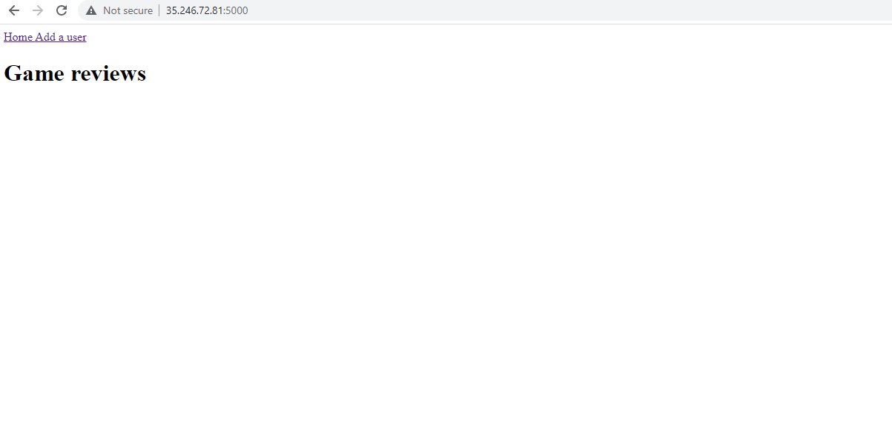
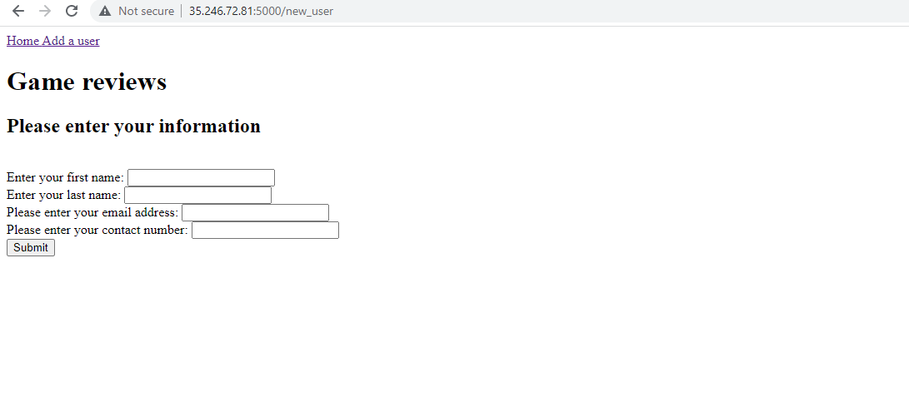
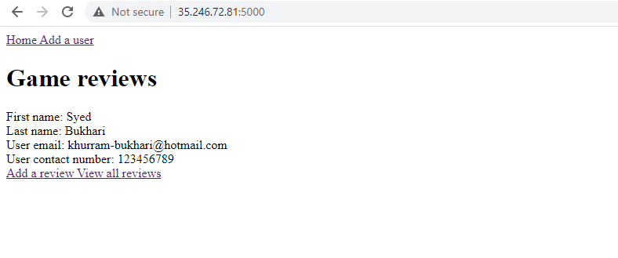
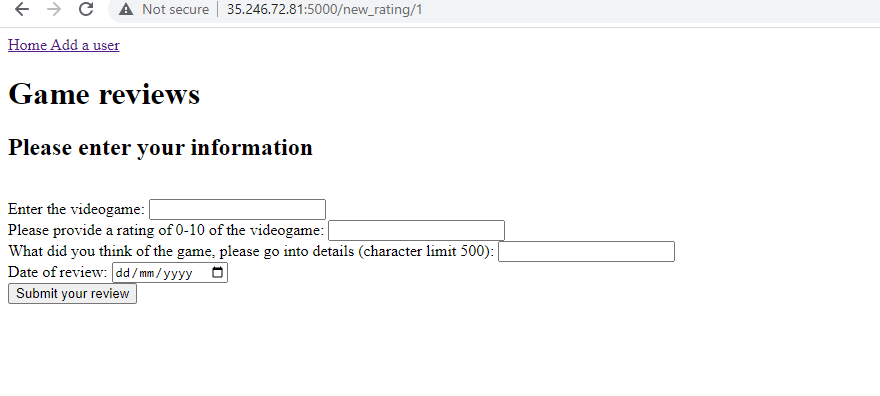
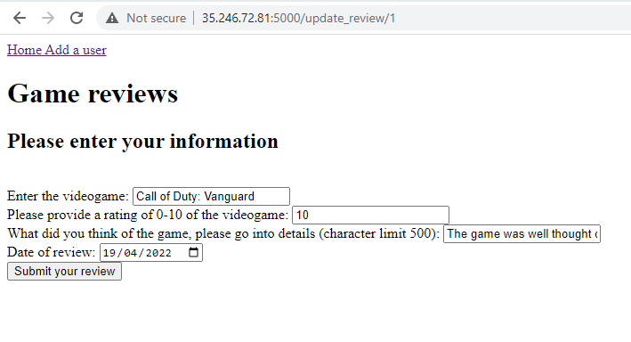

# Community Game Review Application

## Contents

* [Objectives](#objectives)
* [Requirements of Project](#requirements-for-successful-completion-of-this-project)
* [My approach](#my-approach)
* [Design](#design)
* [CI Pipeline](#ci-pipeline)
* [Risk Assessment](#risk-assessment)
* [Future Improvements](#future-improvements)
* [Final Thoughts](#final-thoughts)

### Helpful Resources
* Kanban board: 
* Video Presentation:
* Website URL: http://35.246.72.81:5000/

 
 

## Objectives

In this project, we were tasked to create an application which has create, read, update and delete (CRUD) functionality.
The specific task set was "To create a CRUD application with utilisation of supporting tools, methodologies and technologies that encapsulate all core modules covered during training".

The main reason we were tasked to complete this project was for trainers to be able to gauge and assess our ability of using the tools and methodologies we have been taught over the first 4 weeks of training. We are being marked against the SFIA standards.

 
 
 

## Requirements for successful completion of this project
Below I will list all the additional requirements alongside this application for succesful completion of this project.
* A Trello board
* One database consisting of 2 tables which model a relationship.
* Documentation from a design phase which describes the architecture of your application and a detailed risk assessment.
* A functional CRUD application created in Python. This application needs to be completed while following the best practices, design principles and meeting all the requirements I have set out on my Kanban Board.
* Tests suites for the application I am creating, as well as automated tests for validation of the application. A minimum of 70% test coverage must be achieved. I have set our a personal target of achieving at least 85% test coverage.
* A front-end functioning website with the use of Flask.
* Code integration into a Version Control System, with the use of the Feature-Branch model, built through a CI server and deployed to a cloud-based virtual machine.

 
 
 

## My Approach
In order to succesfully complete this project, I decided to create a web application which allows users to add reviews of games they have played.
Users will be able to:
* Create user accounts and reviews to satisfy the 'Create'.
* Underneath user accounts, there will be a button which grants access to all the reviews a user has left. This will satisfy 'Read'.
* Once a review has been left, users have the ability to go back into the users' review and update or delete the review which has been left. This satisfies both 'Update' and 'Delete'.

To create a user account, users have to provide the following information:
* First Name
* Last Name
* Email Address
* Contact Number

 

To create a new review, users have to provide the following information:
* Title of the videogame
* Rating as a score from 0-10
* Description of the review, why they rated it where they did and what could be improved.
* Date of review - This is set as default but users have the ability to change this to the date they played the game or change the date if they decide to update the review in the future.

 
 
 

## Risk Assessment
Below, you are able to see a detailed risk assessment which outlines the risks that I encounter while creating this project and after launch. I have included a brief description of the risk, what that risk consists of, the likelihood of this risk coming into fruition, the impact level, who is responsible for reducing this risk, the response if it occurs and lastly control measures to minimise the chances of a risk occurring.
 
 

 
 
 

## Design
  
The application model shown within the ERD displays a one-to-many relationship between the User and Review table. This means that one user is able to make many reviews and a review is only able to link to one user. This fulfills the requirement of a relational database, where one table links with the other with a one-to-many relationship.

 
 
 

## Application
When launching the application, the user will be presented with this page. If they want to create their user, they have to click add a user on the navigation bar.

 

After clicking the add a user button on the navigation bar, the user will be presented with the following page to input their information.

 

Once the user has added their information and submitted it, they will be redirected to the homepage with their information on it.

 

After being presented with their user information, the user can then click add a review which will then take them to the add a review page.

 

After adding the review, this will be the page that the user is presented with. It will include all of the information they inputted from the previous page.

 

Users can then go ahead and update their review. They will be prompted with the previous add a review page, the only difference is that once they change the information, a second review will not be added, the existing review will be updated.

 
 
 

## CI Pipeline

The CI Pipeline is also known as the Continuous Integration Pipeline. I have used this as it allows for quick deployment of any code I have developed. This rapid deployment is done through the automation of integration processes.
* Once I push my code on to GitHub, a webhook is used to push that code into Jenkins, automatically installing the code into the Cloud VM. 
* Using this gave me the ability to automate testing and retrieve reports on any issues, alongside seeing whether my application is running as intended.

## Unit Testing & Test Coverage
Pytest and Jenkins has been crucial in finding out whether my application is functioning as intended. As it stands, I have achieved 95% coverage in Pytest and 93% in the Jenkins coverage report.

Below is a test coverage report generated by Pytest:

Below is a test coverage report generated by Jenkins:

Below is the console output for the automated unit testing through Jenkins.

 
 
 

## Future Improvements
* In the future, I would like to implement a login page where a user can only access his own reviews when it comes to deleting and updating. As it stand currently, anybody can delete or update anyone's review as there are not permissions set according to users. 
* In additon to this, I would like to implement a function to delete users as only reviews can currently be deleted.
* Penultimately, I need to implement an error page when submit is clicked for both users and reviews while nothing is put into the fields.
* Lastly, I think that I could create a better user experience by spacing out the navigation bar and adding a bit more colour to make it more appealing as the website as a whole currently looks bland.

 
 
 

## Final Thoughts
For my first project, I believe I have created a well-rounded CRUD application, though there are quite a few things I could add to make it more user friendly and more appealing as a whole. Alongside this, there is functionality I could add on to the User page for ease of use and a sign in page so only the user who added the review can delete it.

This project has taught me some very valuable skills for troubleshooting, Python and Flask. I believe this is a fantastic stepping stone as an introduction into software development and I will most definitely be taking these skills and using them in future positions within companies.

